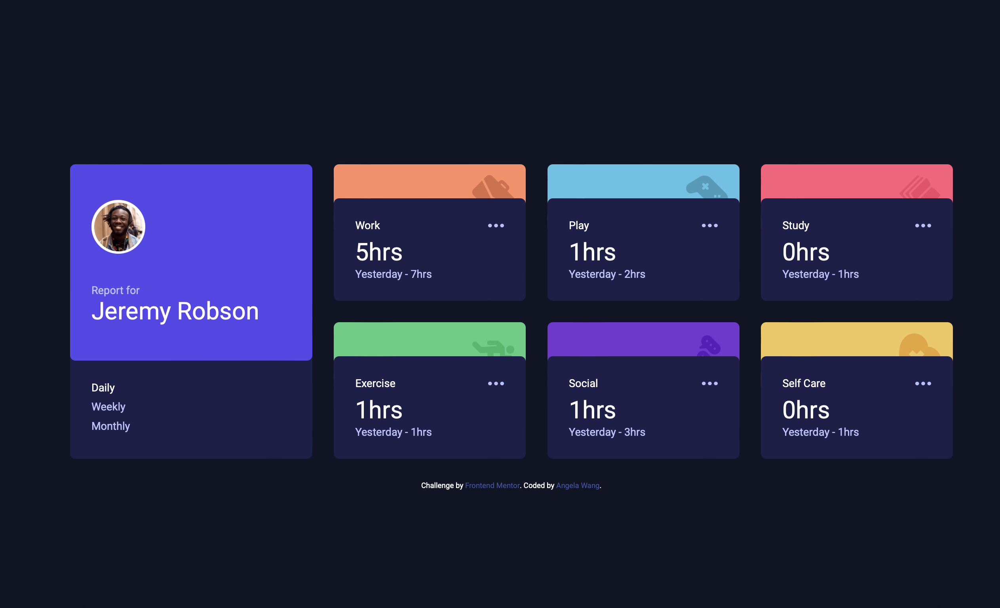

# Frontend Mentor - Time tracking dashboard solution

This is a solution to the [Time tracking dashboard challenge on Frontend Mentor](https://www.frontendmentor.io/challenges/time-tracking-dashboard-UIQ7167Jw). Frontend Mentor challenges help you improve your coding skills by building realistic projects.

## Table of contents

- [Overview](#overview)
  - [The challenge](#the-challenge)
  - [Screenshot](#screenshot)
  - [Links](#links)
- [My process](#my-process)
  - [Built with](#built-with)
  - [What I learned](#what-i-learned)
  - [Continued development](#continued-development)
  - [Useful resources](#useful-resources)
- [Author](#author)

## Overview

### The challenge

Users should be able to:

- View the optimal layout for the site depending on their device's screen size
- See hover states for all interactive elements on the page
- Switch between viewing Daily, Weekly, and Monthly stats

### Screenshot

### Links

- Solution URL: [Add solution URL here](https://your-solution-url.com)
- Live Site URL: [Add live site URL here](https://your-live-site-url.com)

## My process

### Built with

- Semantic HTML5 markup
- CSS custom properties
- Flexbox
- Mobile-first workflow
- [tailwindcss](https://v3.tailwindcss.com/) - 幫助我了解 tailwind 的各種使用。
- [vuejs](https://zh-hk.vuejs.org/) - 幫助我認識 Vue.js 框架應用

### What I learned

學習 tailwind 自定義樣式
學習 tailwind 自定義圖片的使用
學習 tailwind 偽元素::before ::after 的使用
學習 tailwind 自定義圖片與偽元素結合應用
學習 在 Vue.js 框架的使用下，與 taiwind 的配合。
學習 Vue.js 框架如何載入外部 API 資訊與彙整資訊
學習 Vue.js 如何動態變更資訊
學習 Vue.js class 設定可分為兩種/物件式與陣列式
學習 Vue.js click 設定方法

### Continued development

未來或許可以增加
圖表表現、登入系統、每個卡片項目的功能按鍵系統。

### Useful resources

- [tailwindcss](https://v3.tailwindcss.com/) - 幫助我了解 tailwind 的各種使用。
- [vuejs](https://zh-hk.vuejs.org/) - 幫助我認識 Vue.js 框架應用

## Author

- Website - [Angela Wang](https://www.your-site.com)
- Frontend Mentor - [@AngelaWang](https://www.frontendmentor.io/profile/AngelaWang)
